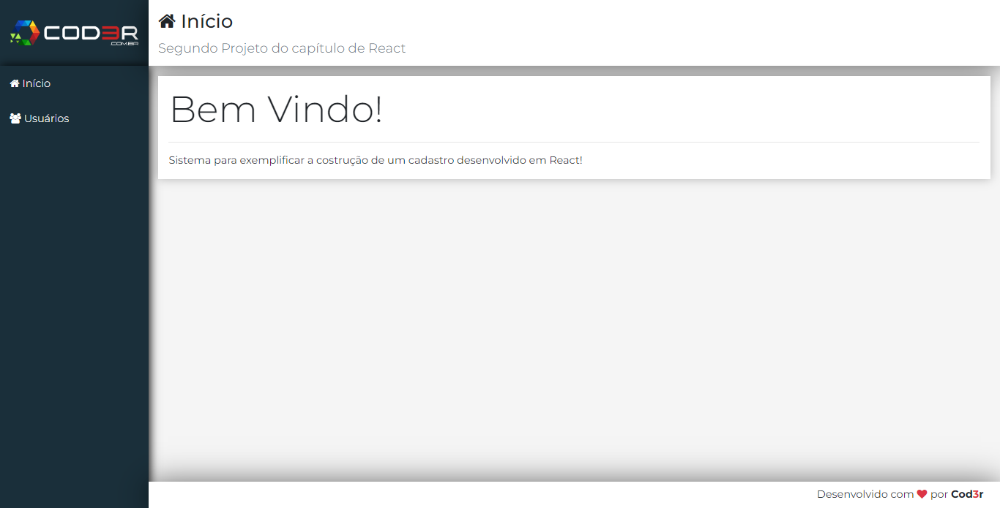
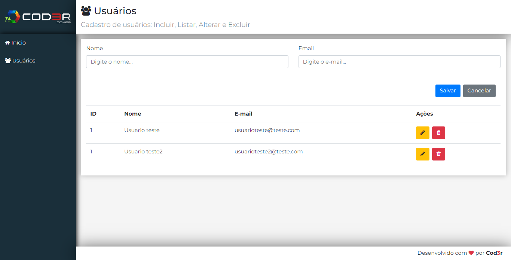

# Crud Cadastro de Usuario

## Sobre o projeto:
Crud(Create (criar), Read (ler), Update (atualizar), Delete (apagar)): foi um projeto de cadastro de usuários feito no curso de Web Moderno da Cod3r no modulo de React.js. 

O que eu aprendi nesse projeto: 
- Criar um backend “fake” com o JSON-Server para testarmos uma aplicação frontend.
- Manipular os estados de um componente.
- Criação de rotas com o react-routes para a navegação dendro da página.
- Estilização usando o bootstrap no React.js 
- Fazer requisições para o backend usando o Axios.  

## 🛠 Tecnologias:
- JavaScript
- React.js
- Vite
- Axios
- Bootstrap
